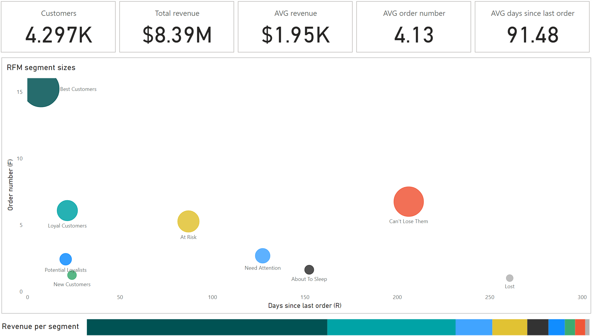

# RFM Analysis for Marketing Team

## Project Overview

The objective of this project is to segment customers based on RFM (Recency, Frequency, Monetary value) scores and provide insights for the marketing team to focus on specific customer segments. Using SQL and Power BI, I performed an RFM analysis on customer purchase data, segmented customers into categories, and developed a dashboard for visualization and insights.

Since this was a learning task, it’s scoped to be a quick analysis rather than a comprehensive project.

## Dataset Information

This project was developed using a proprietary dataset provided for educational purposes, which is not included in the repository due to restrictions. Redistribution or commercial use of the project contents is not permitted.

Key columns in the dataset include:
- **"CustomerID"** - unique identifier for each customer.
- **"InvoiceNo"** - invoice number representing each transaction.
- **"InvoiceDate"** - date of transaction.
- **"Quantity"** - number of items purchased in each transaction.
- **"UnitPrice"** - price per unit of the purchased item.

It also had additional columns, but they were not used in analysis. If you'd like to replicate the analysis, you may substitute with a similar dataset.

## Methodology

1. **Data Preprocessing.** Filtered data for valid transactions (positive quantities and unit prices) within the specified date range (2010-12-01 to 2011-12-01).
2. **Calculation of RFM Metrics:**
    - **Recency (R)** - days since the last purchase (relative to 2011-12-01).
    - **Frequency (F)** - total number of unique transactions per customer.
    - **Monetary Value (M)** - total amount spent by each customer.
3. **RFM Scoring.** Used quartiles to assign scores for each RFM metric (1-4 scale, where 1 is best). Scores were calculated as follows:
    - **R_score** - based on the recency quartile, with lower values indicating more recent purchases.
    - **F_score** - based on the frequency quartile, with lower values indicating more frequent purchases.
    - **M_score** - based on the monetary value quartile, with lower values indicating higher spending.
4. **Customer Segmentation.** Combined R, F, and M scores to assign customers to segments such as "Best Customers", "Loyal Customers", "Potential Loyalists", "At Risk" "Need Attention", "About To Sleep", "Can't Lose Them" and "Lost". Descriptions of each are available in Power BI dashboard by hovering over segments. 

## Tech Stack

- **SQL** (BigQuery) – for data extraction and calculations.
- **Power BI** – for creating quick visualization.

## Key Findings

Quick note - as below is only a screenshot, dashboard's interactive features can be seen when opening Power Bi version. 

    

1. **At Risk**:
    - Customers in this segment have historically spent a high amount and bought frequently but have not made recent purchases.
    - Comprising nearly 200 clients, this group represents the fourth-largest revenue source.
2. **Need attention**:
    - These customers are above-average spenders with a few purchases but have not bought recently.
    - With around 500 clients, this segment is the third-largest revenue generator.
3. **Can't lose them**:
    -  This group includes top spenders who have made frequent purchases but have not been active recently.
    -  Although there are only 28 clients in this segment, they represent high potential due to their previous spending habits.

## Recommendations

Based on the RFM analysis, I recommend that the marketing team focuses on reactivating "At Risk," "Need Attention," and "Can't Lose Them" segments. Implementing personalized campaigns tailored to each segment’s behavior and spending patterns can help improve retention and increase revenue.

### Suggested Marketing Actions

1. **At Risk** - target this segment with personalized emails, renewal offers, or reactivation campaigns to prevent them from becoming lost customers.
2. **Need Attention** - reactivate these customers with tailored recommendations, limited-time offers, or targeted promotions to encourage them to purchase again.
3. **Can't Lose Them** - should try to win them back by trying to connect and offer specialized offers, newer products, asking for feedback to understand their needs better. 

## Possible Analysis Improvements

To further enhance this analysis, future steps could include:
- Original dataset provides more information. Thus, it would be possible to add additional segmentation options based on country or products.
- Adding additional functionality to the RFM dashboard in order for marketing team to be able to access more information about segments. 

## How to Use This Repository

1. **"SQL_rfm_scores"** - SQL query for RFM score calculation.
2. **"rfm_dashboard_ss"** - visualization from Power BI provided as a screenshot.
3. **"rfm_dashboard_power_bi"** - dashboard in Power BI format. It offers additional interactivity. 

## Contact

LinkedIn - [Agnė Vabalaitė](www.linkedin.com/in/agnė-vabalaitė).
Gmail - vab.agne@gmail.com